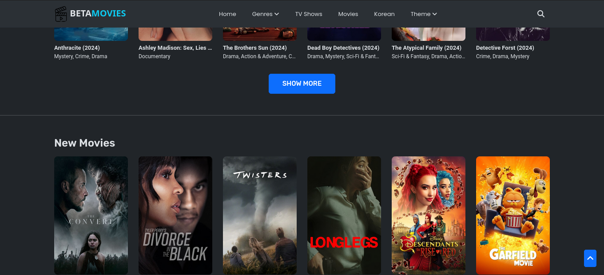
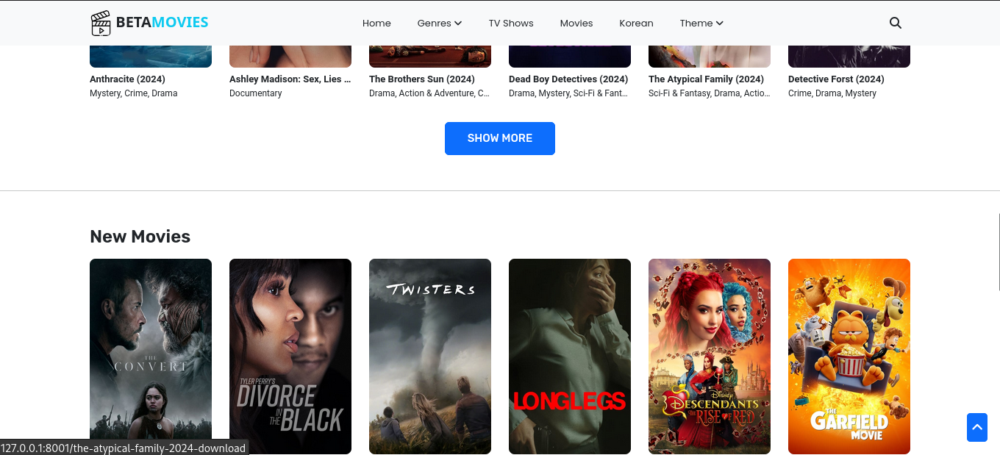
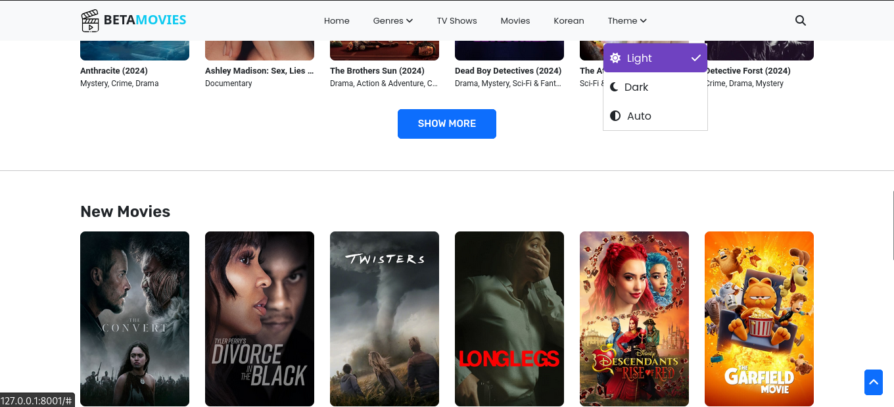

<p align="center"><a href="https://laravel.com" target="_blank"></a>


</p>

<h4 align="center">📱 Contact & 👨 Social</h4>
<p align="center">
<!-- <a href="https://github.com/laravel/framework/actions"></a>
<a href="https://packagist.org/packages/laravel/framework"></a>
<a href="https://packagist.org/packages/laravel/framework"></a>
<a href="https://packagist.org/packages/laravel/framework"></a> -->
<a href=""></a>
<a href=""></a>
<a href=""></a>
</p>

<h4 align="center">🚀 Skills</h4>
<p align="center">
<a href=""></a>
<a href=""></a>
<a href=""></a>
<a href=""></a>
<a href=""></a>
<a href=""></a>
<a href=""></a>
</p>

<h4 align="center">💻 OS</h4>
<p align="center">
<a href=""></a>
<a href=""></a>
</p>


# 🎬 Movie Website Project

## Overview
The Movie Website Project is a web application designed to provide users with information about movies, including details such as title, release date, cast, plot summary, and user ratings It allows users to browse movies, search for specific titles, and view detailed information about each movie.





## Features
- **Browse Movies:** Users can browse a list of movies available in the database.
- **Search:** Users can search for movies by title or keywords.
- **Movie Details:** Users can view detailed information about each movie, including title, release date, cast, plot summary

## 🛠️ Installation
### Prerequisites
- PHP
- Laravel
- MySQL database
- Xampp server (or any of your choice)
### Installation Steps
1. Clone the repository:
   ```bash
   git clone https://github.com/obahchimaobi/Cinema.git
   cd Cinema
   ```

2. Install dependencies:
   - Navigate to the project directory and run:
     ```bash
     composer install
     npm install
     ```

3. Set up the database:
   - Create a MySQL database and update the database configuration in the `.env` file.

4. Migrate the database schema:
   ```bash
   php artisan migrate
   ```

5. Seed the database with initial data (optional):
   ```bash
   php artisan db:seed
   ```

6. Start the Laravel development server:
   ```bash
   php artisan serve
   ```

7. Access the application in your web browser at `http://127.0.0.1:8000`.

## Usage
1. **🏠 Home Page:** The home page displays a list of all movies.
2. **🔍 Search:** Use the search bar to find specific movies by title or keywords.
3. **🎥 Movie Details:** Click on a movie title to view detailed information about the movie, including its cast, plot summary.

## 🤝 Contributing
We welcome contributions from the community to improve the Movie Website Project. If you would like to contribute, please follow these steps:
1. Fork the repository and create a new branch for your feature or bug fix.
2. Make your changes and ensure the code passes all tests.
3. Submit a pull request explaining the changes you've made and why they are necessary.

## 📝 License
This project is licensed under the MIT License - see the [LICENSE](LICENSE) file for details.

## Acknowledgements
<a href="https://getbootstrap.com" target="_blank"></a>
<a href="https:://php.net" target="_blank"></a>
<a href="https://laravel.com" target="_blank"></a>
<a href="https://mysql.com" target="_blank"></a>

## 📧 Contact
For any inquiries or support, please contact [anthonyobah37@gmail.com](mailto:anthonyobah37@email.com).
